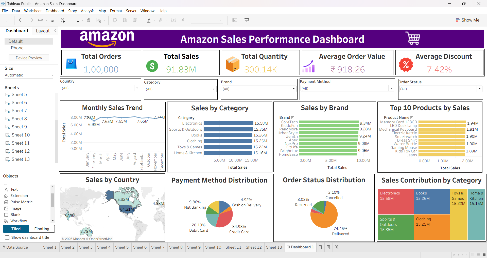

# 📊 Amazon Sales Performance Dashboard

# 📌 1. Project Overview

The **Amazon Sales Performance Dashboard** is an interactive business intelligence dashboard developed using **Tableau**. This project analyzes Amazon sales data to monitor key business metrics, identify sales trends, evaluate product performance, and support data-driven business decisions.
The dashboard provides stakeholders with an easy-to-understand visual representation of sales performance across multiple dimensions such as product categories, brands, payment methods, order status, and geographical locations.

---

# 🎯 2. Objective

The objectives of this project are to:

- Analyze overall Amazon sales performance.
- Monitor monthly sales trends.
- Identify top-performing product categories.
- Analyze brand-wise sales performance.
- Discover top-selling products.
- Evaluate sales distribution across different countries.
- Analyze customer payment preferences.
- Monitor order delivery status.
- Build an interactive dashboard for business decision-making.

---

# 🗂️ 3. Dataset Information

### Dataset Summary

- **Dataset Name:** Amazon Sales Dataset
- **File Format:** CSV
- **Total Records:** 100,001
- **Visualization Tool:** Tableau Public

### Dataset Columns

| Column Name | Data Type | Description |
|-------------|-----------|-------------|
| Order ID | Integer | Unique identifier for each order |
| Order Date | Date | Date when the order was placed |
| Customer ID | Integer | Unique customer identifier |
| Customer Name | String | Name of the customer |
| Country | String | Customer's country |
| State | String | Customer's state |
| City | String | Customer's city |
| Product ID | Integer | Unique product identifier |
| Product Name | String | Name of the product |
| Category | String | Product category |
| Brand | String | Product brand |
| Seller ID | Integer | Unique seller identifier |
| Quantity | Integer | Number of products sold |
| Unit Price | Decimal | Selling price per unit |
| Shipping Cost | Decimal | Shipping charges |
| Tax | Decimal | Tax amount |
| Discount | Percentage | Discount offered |
| Total Amount | Decimal | Final sales amount after discount and tax |
| Payment Method | String | Customer payment method |
| Order Status | String | Delivered, Cancelled, Returned, Pending |

---

# 🚀 4. Dashboard Features

### 📌 KPI Cards

- Total Orders
- Total Sales
- Total Quantity Sold
- Average Order Value
- Average Discount

### 📈 Interactive Visualizations

- Monthly Sales Trend (Line Chart)
- Sales by Category (Horizontal Bar Chart)
- Sales by Brand (Horizontal Bar Chart)
- Top 10 Products by Sales
- Sales by Country (Filled Map)
- Payment Method Distribution (Pie Chart)
- Order Status Distribution (Pie Chart)
- Sales Contribution by Category (Treemap)

### 🎛 Interactive Filters

- Country
- Category
- Brand
- Payment Method
- Order Status

---

# 🖥️ 5. Dashboard Preview

Below is the interactive Tableau dashboard developed for analyzing Amazon Sales Performance.

---

# 💡 6. Business Insights

- Electronics generated the highest overall sales revenue.
- Credit Card is the most preferred payment method among customers.
- Most customer orders were successfully delivered.
- Monthly sales remained relatively stable throughout the year with only minor fluctuations.
- Top-performing brands consistently contributed to overall revenue.
- A small number of products generated a significant portion of total sales.
- Sales are concentrated across major countries.
- Product categories contributed almost equally, indicating a diversified sales portfolio.

---

# 📋 7. Business Recommendations

- Increase inventory for high-performing product categories.
- Promote top-selling brands through targeted marketing campaigns.
- Improve logistics to reduce returned and cancelled orders.
- Expand operations in high-performing countries.
- Introduce customer loyalty programs to improve repeat purchases.
- Optimize discount strategies to improve profitability.
- Monitor monthly sales trends for better inventory planning and forecasting.

---

# 📑 8. Business Requirements

The dashboard is designed to answer the following business questions:

1. What are the overall Total Sales, Total Orders, Total Quantity Sold, Average Order Value, and Average Discount?

2. How do sales vary across different months?

3. Which product category generates the highest sales?

4. Which brands contribute the most to total revenue?

5. What are the Top 10 best-selling products based on sales?

6. Which countries contribute the highest sales revenue?

7. Which payment method is preferred by customers?

8. What is the distribution of order statuses (Delivered, Returned, Cancelled, and Pending)?

9. How much does each product category contribute to the overall sales?

10. How do sales change when users apply filters such as Country, Category, Brand, Payment Method, and Order Status?

---

# 🛠️ 9. Tools & Technologies

| Tool | Purpose |
|------|---------|
| Tableau Public | Dashboard Development |
| Microsoft Excel | Data Preparation |
| CSV Dataset | Data Source |
| Data Cleaning | Data Preprocessing |
| Data Visualization | Interactive Dashboard Design |
| Business Analytics | Business Insight Generation |

---

# ✅ 10. Conclusion

The **Amazon Sales Performance Dashboard** provides a comprehensive and interactive view of Amazon sales performance through KPIs, charts, maps, and filters. It enables stakeholders to monitor business performance, identify sales trends, evaluate product performance, understand customer purchasing behavior, and make informed business decisions.

This project demonstrates practical skills in **Tableau Dashboard Development, Business Analytics, Data Visualization, KPI Design, Interactive Reporting, and Data Storytelling**, making it highly relevant for **Business Analyst** and **Marketing Analyst** roles.

---

# 👨‍💻  Author

## Khushikumar Shahukara

**MBA – Business Analytics & Marketing**

**Passionate about  to become a Business Analyst & Marketing Analyst**

---

## ⭐ If you found this project useful, please consider giving it a Star!
